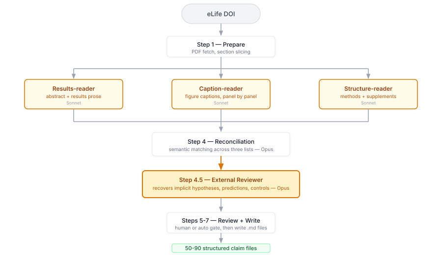

<!--
  Simplified slide deck for the eLife technical team.
  Fewer slides, less text, no assumed background knowledge.

  Render to HTML:  npx @marp-team/marp-cli@latest PRESENTATION-OVERVIEW.md -o presentation-overview.html
  Render to PDF:   npx @marp-team/marp-cli@latest PRESENTATION-OVERVIEW.md --pdf -o presentation-overview.pdf
  Render to PPTX:  npx @marp-team/marp-cli@latest PRESENTATION-OVERVIEW.md --pptx -o presentation-overview.pptx

  Pacing target: ~25 slides, 35-45 minutes including discussion.
-->
---
marp: true
theme: default
paginate: true
size: 16:9
header: 'elife-claim-trees'
footer: 'Mainen Lab / eLife  |  2026-05-11'
style: |
  section {
    font-family: Inter, system-ui, sans-serif;
    background: white;
    color: #111827;
    padding: 60px 80px;
  }
  h1 {
    font-size: 1.875rem;
    letter-spacing: -0.02em;
    border-bottom: 1px solid #e5e7eb;
    padding-bottom: 12px;
    margin-bottom: 24px;
  }
  h2 {
    font-size: 1.25rem;
    color: #6b7280;
    font-weight: 500;
    margin-top: -12px;
    margin-bottom: 32px;
  }
  table {
    font-size: 0.875rem;
    border-collapse: collapse;
  }
  th {
    text-align: left;
    text-transform: uppercase;
    font-size: 0.75rem;
    letter-spacing: 0.04em;
    color: #6b7280;
    padding: 8px 12px;
    border-bottom: 2px solid #e5e7eb;
  }
  td {
    padding: 8px 12px;
    border-bottom: 1px solid #f3f4f6;
    vertical-align: top;
  }
  code {
    font-family: 'SF Mono', Menlo, monospace;
    font-size: 0.85em;
    background: #f3f4f6;
    padding: 2px 6px;
    border-radius: 3px;
  }
  pre code {
    background: transparent;
    font-size: 0.75rem;
    line-height: 1.5;
  }
  pre {
    background: #f9fafb;
    border: 1px solid #e5e7eb;
    border-radius: 6px;
    padding: 16px;
  }
  blockquote {
    border-left: 3px solid #d1d5db;
    color: #4b5563;
    padding-left: 16px;
    font-style: normal;
  }
  .highlight {
    color: #d97706;
    font-weight: 600;
  }
  .small {
    font-size: 0.875rem;
    color: #6b7280;
  }
---

<!-- _class: lead -->

# elife-claim-trees
## Toward claim-level scientific knowledge

**Zach Mainen** — Mainen Lab, Champalimaud Foundation

2026-05-11

Docs: `https://zmainen.github.io/elife-claim-trees/docs/`

---

# How does science change with AI?

One answer: **the unit of knowledge changes**.

Science currently works with **papers** as the fundamental unit. But papers are coarse — each one contains dozens of individual elements: a statistical result, a figure panel showing a correlation, a hypothesis, a methodological decision.

We call these elements **claims**.

AI creates the opportunity to work at the level of individual claims — to extract them, structure them, link them across papers, and eventually to compose science in claim-level units from the start.

---

# What is a claim?

A claim is **one declarative proposition** from a paper, tied to its evidence.

```yaml
claim: Doubling distal dendritic inhibition reduces
       somatic firing rate from ~5.5 Hz to ~0.2 Hz.
panel: fig4, fig5
role:  empirical
```

- Anchored to a **specific figure panel** — where the evidence lives
- Classified by **role** — empirical result, hypothesis, prediction, control
- Linked to **other claims** — supports, requires, dissociates-with

Claims need not be stated explicitly. Hypotheses and predictions are often **implicit** in the structure of the experiment, not written out in the text.

> "The unit of publication is not a figure or a statistic — it is a computer program."
> — Kenneth Harris, formulating this idea at an early eLife meeting

A claim is that computation: data in, analysis, result out. The panel is where one computation lives.

---

# The vision: a claim-level knowledge graph

Today we have the **paper-citation graph**: "Paper A cites Paper B." Useful, but coarse.

A **claim-level knowledge graph** would be much finer-grained — describing the relationships of dependency between individual claims across a corpus of papers in a field.

- At **N = 10 papers**, it's a demonstration
- At **N = 1,000**, it's a research instrument
- At **N = 100,000**, it's the structure of a field

Unlike the paper-citation graph, you can ask: *"what does the field actually say about X?"* and get an answer grounded in specific, traceable propositions.

---

# Two paths to get there

**Path 1: Extract from existing papers.**
Scientists don't yet work in claim-level units. For the existing corpus — and for papers that will be submitted before anyone adopts claim-native authoring — we can do a conversion: interpret a paper into a structured set of claims using AI agents. **This is what we've built.**

**Path 2: Author tools.**
Help scientists compose submissions as claim-units from the start — making the paper composition process more claim-like. Reduces the need for extraction over time. **Not yet built, but part of the plan.**

Both paths serve the same goal. The extraction pipeline (Path 1) is what's on the table today.

---

# Why this matters beyond extraction

**Claim-level peer review.** QED Science has been pioneering this. When a paper is structured as claims, reviewers can comment on specific propositions, disagreements localize, and the process becomes more transparent.

**Benefits for authors.** Thinking in claims helps authors clarify what they're actually arguing — which results are empirical, which are interpretive, which depend on which.

**Agent-driven science.** A longer-horizon experiment: a sandbox where AI agents publish at claim-level granularity. Claims are the right unit for this — papers are too coarse for agents to compose and review at scale.

---

# What we've built: a working draft

I've developed an extraction pipeline using language models as agents who review the paper — from the figures and the text — and extract a series of claims.

- **Working** — tested on 10 eLife papers, with measured results
- **A draft** — it needs investigation and improvements
- **Incorporable** — could be added to a website as an optional feature

Two deployment modes:
- **Author-approved**: an optional add-on the author reviews before publication
- **Public-domain**: run on published open-access papers (eLife, bioRxiv) without author involvement

The rest of this talk: how the pipeline works, how well it works, and where eLife could plug in.

---

# Why not just ask an LLM to read the paper?

We tried. A single model reading the whole paper fails in predictable ways:

- **Quantitative hallucination** — invents precision ("~5 Hz" becomes "5.2 +/- 0.3 Hz")
- **Wrong panel assignment** — attaches claims to the wrong figure panels
- **Misses methodology** — scope conditions, controls, analytical decisions are flattened
- **Misses deductive structure** — implicit hypotheses and predictions disappear

Each failure mode requires its own architectural fix.

---

# The pipeline



---

# What each agent catches

| Agent | Reads | Good at |
|:------|:------|:--------|
| **Results-reader** | Abstract + results text | Hypotheses, predictions, synthesis claims |
| **Caption-reader** | Figure captions, panel by panel | Exact numbers, panel anchoring |
| **Structure-reader** | Methods + supplements | Controls, scope conditions, methodological claims |

**No agent sees another's output.** The reconciler (a separate model call) aligns their outputs semantically and flags disagreements.

---

# The external reviewer

Many important claims are **never stated explicitly** in the paper. The hypothesis the paper tests, the predictions that follow from its model — these live in the architecture of the experiment, not in the prose.

Human curators infer these. A prose-reading LLM misses them.

**The external reviewer** is a separate model pass that reads the whole paper plus the reconciled draft, looking for:

- Implicit hypotheses
- Predictions deduced from the modelling structure
- Claims that function as controls (not just results)

This single addition lifts role classification from **~65% to ~83%** agreement with curators.

---

# The full pipeline

| Step | What happens | Who does it |
|:-----|:-------------|:------------|
| 1. Prepare | Fetch PDF, slice into sections | Automated |
| 2-3. Extract | Three independent agents read their slices | Sonnet (x3) |
| 4. Reconcile | Merge three lists into one draft | Opus |
| 4.5. Review | Recover implicit structure | Opus |
| 5. Gate | Human reviews or Opus substitutes | Configurable |
| 6-7. Write | Produce claim files with frontmatter | Automated |

**Input:** one DOI. **Output:** 50-90 structured claim files.

**Per paper: ~$7 API cost, ~15 minutes.**

---

# Claim roles — the 9 rhetorical functions

Every claim has a **role** — what function it serves in the paper's argument. The methodology defines 9:

| | Role | What it marks |
|:-|:-----|:-------------|
| | **hypothesis** | The paper's central bet — often implicit |
| | **prediction** | A testable consequence of the hypothesis |
| | **empirical** | A measured or computed result, panel-grounded |
| | **control** | An empirical result that rules out an alternative |
| | **scope** | A boundary condition on the results ("all results come from...") |
| | **methodological** | A capability of the apparatus or analysis |
| | **synthesis** | Integrates multiple results into one statement |
| | **interpretation** | Reframes results through a theoretical lens |
| | **literature-context** | A cited prior result the paper depends on |

Getting the role right determines where the claim sits in the argument structure and what edges it can carry in the dependency graph.

---

# How do we measure quality?

We ran the pipeline on **10 eLife papers** and compared the output against a **reference set** — an earlier iteration of the same extraction process, done semi-manually.

This is a **self-consistency metric**, not a ground truth comparison. It tells us: does the automated pipeline produce output that agrees with a prior analysis of the same papers?

Three metrics:
- **Recovery** — did the system find the same claims as the reference?
- **Role** — did it assign the same role (hypothesis, empirical, control, etc.)?
- **Panel** — did it assign the same figure panel?

---

# Self-consistency results (10 papers)

| Metric | Mean | Target | Status |
|:-------|-----:|-------:|:------:|
| **Claim recovery** | **96.9%** | 80% | PASS |
| **Role agreement** | **83.1%** | 75% | PASS |
| Panel agreement | 60.9% | 90% | FAIL |

The system is **stable and reproducible** — it consistently finds the same claims and assigns similar roles. The external reviewer is what drives role agreement (without it: ~65%).

Panel agreement is a known limitation. Multi-panel claims collapse. Next iteration target.

---

# Toward real ground truth

Self-consistency tells us the system is stable. These would tell us it's **correct**:

- **Human editorial benchmark** — editors or trained analysts create independent ground truth for a test set
- **Compare to peer reviewers** — digest review reports into claims, compare to extracted claims. Are they talking about the same things?
- **Compare to QED Science** — QED does claim-level structuring at journals. How do the two approaches compare?
- **Author validation** — show authors their paper's extracted claims. Do they agree?

Each gives a different angle on quality. These are natural next steps for a collaboration.

---

# The system improves empirically

Every prompt change is tested against the 10-paper corpus before shipping.

**Worked example:** Kammer 2026 (a foveal feedback paper) scored 57% on role agreement — worst in the corpus. We looked at the 9 mismatches and found 3 patterns:

- The system labeled **control experiments** as plain `empirical` — it didn't recognize their eliminative function
- It called **hypotheses** `prediction` — shifting the argument layer down
- It missed **literature-context** claims — prior results the paper depends on but didn't produce

We added rules to the external reviewer prompt to catch each pattern, re-ran on that paper (cost: ~$10), and role agreement jumped from 57% to 71%. Then we re-ran all 10 papers (~$100): the corpus-wide mean rose from 78% to 83%, with only one small regression.

**Prompt engineering as hypothesis testing, not guesswork.**

---

# Figure reproduction

Claims aren't just text — they link to **deposited code and data**. For 6 of the 10 papers, we ran the authors' analysis scripts and reproduced the figures.

- **68 of 245 claims** (28%) are backed by a reproduced figure
- **15 figures** reproduced across 6 papers — original and reproduction side by side on the website
- Reproductions run the authors' deposited code on their deposited data — no re-implementation

This is the verification layer: each claim links to its computation, and the computation has been independently executed. When a reproduced figure matches the original, the claim is **verified by code**.

The other 72% of claims are not yet verified — some papers lack deposited code, some analyses need environments we haven't set up. Expanding verification coverage is a natural next step.

---

# Current status

**What works:**
- Full 8-step pipeline, automated end to end
- 10-paper validation with measured performance
- 32-page documentation site
- Version-controlled prompts, evaluation harness

**What's still iterating:**
- Panel assignment (60%, target 90%) — next prompt iteration target
- 2 of 10 papers below role threshold — methods papers need prompt variants
- Dependency mapping (Step 6) — currently analyst work
- Authoring tools — not started

**This is a working draft, not a finished product.** Iteration is part of the design.

---

# Demo — the website

**Let's look at a paper:**

[`zmainen.github.io/elife-claim-trees/`](https://zmainen.github.io/elife-claim-trees/)

What you'll see for each paper:

- **Claim list** — all extracted claims with roles and panel anchors
- **Dependency graph** — interactive DAG showing how claims relate
- **Claim structure** — hierarchical view (hypothesis -> predictions -> tests)
- **Abstract alignment** — which claims map to which sentences in the abstract

---

# Where could eLife plug in?

Recall the two paths from the introduction: **extract existing papers** and **build author tools**. The extraction pipeline is built. Here's where joint work would make the most difference:

- **Integration** — the pipeline currently outputs files. Wrapping it as a service for eLife's editorial system is straightforward engineering (~2 weeks for an HTTP API).

- **User experience** — we have a per-paper claim viewer. Cross-paper search, an editorial review surface, author-facing tools — these need design and product thinking that eLife's team is better positioned to do.

- **Improving the extraction** — the prompts are markdown files in version control. The evaluation harness measures every change. A data science team can iterate on prompt variants, test cheaper models, and expand the reference corpus.

- **Scaling** — at $7/paper and 15 min, it works for hundreds of papers. For thousands, we'd need batch processing, concurrent execution, and domain-specific variants.

---

# Economics at scale

| Scale | Cost | Time |
|:------|-----:|:-----|
| 1 paper | $7 | 15 min |
| 100 papers | $700 | ~1 day (parallelized) |
| 1,000 papers | $7K | ~3 days (parallelized) |

Cost-reduction levers exist (batch APIs, cheaper models for some agents, concurrent execution) that could cut cost roughly in half — but they need engineering and quality measurement before deployment.

eLife scale (hundreds/year) is tractable today.

---

# How to try it yourself

```bash
pip install elife-extract

# Extract claims from any eLife paper by DOI
elife-extract extract --doi 10.7554/eLife.95562 --output-dir ./out

# Review and write claim files
elife-extract write --draft ./out/draft-*.json \
  --corpus-dir ./claims --review-mode external

# See what you got
ls ./claims/headley-2024-*/
```

**What you need:** Python 3.10+, an Anthropic API key (or Vertex AI credentials).

**Per paper:** ~$7, ~15 minutes. The 10 papers in the current corpus were selected by eLife — you could run more of your own the same way.

Full walkthrough: [`docs/cli/first-paper/`](https://zmainen.github.io/elife-claim-trees/docs/cli/first-paper/)

---

# The bigger picture — claim-native publication

Three layers of work, each a step toward science where claims are the fundamental unit:

| Layer | What | Status |
|:------|:-----|:-------|
| **1. Extraction** | Convert existing papers to claim-level structure. The pipeline this talk is about. | **Built and working** |
| **2. Authoring** | Tools that help authors compose papers as claim-units from the start. Makes extraction less necessary over time. | Sketched; not built |
| **3. Sandbox** | A controlled environment where AI agents publish at claim-level granularity — an experiment in what scientific knowledge production looks like at the right unit. | Vision |

The pipeline is layer 1 — it exists because the existing corpus needs handling. Layer 2 reduces that need. Layer 3 is what becomes possible when claim-native is the default.

---

# Next steps

- **Try more papers** — pick papers from different domains and structures. The current 10 are neuroscience; how does it handle other fields?
- **Establish ground truth** — editorial benchmarks, reviewer comparison, author validation
- **Improve the extraction** — panel assignment, methods-paper variants, edge mapping
- **Build the experience** — editorial review surfaces, cross-paper browsing, author tools

---

# Documentation

**Docs site:** [`zmainen.github.io/elife-claim-trees/docs/`](https://zmainen.github.io/elife-claim-trees/docs/)

Covers: methodology, architecture, CLI usage, validation results, cost projections, API reference, contributor guide.

**Source repo:** Python CLI, version-controlled prompts, evaluation harness.

**Contact:** Zach Mainen, zmainen@neuro.fchampalimaud.org

---

# Discussion

